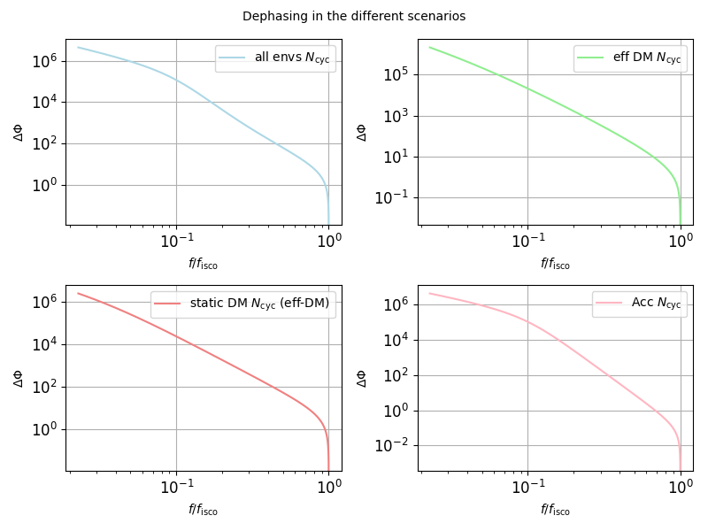

# BinaryEvolution

This repository contains the materials for my thesis project, which focuses on studying the effect of environments on dephasing with respect to vacuum gravitational wave solutions.

## Main-files:

### Phase_extraction-MAIN.ipynb

**Description:** This Jupyter Notebook file contains the final class I developed for generating and analyzing systems to observe dephasing. It implements numerical and analytical integrations for validation and prediction of the detectability of one environment compared to another.

### Phase_extraction_Class+params.ipynb

**Description:** This Jupyter Notebook focuses on defining a class to encapsulate functions necessary for analysis while conducting simulations of dephasing under different parameter sets.

## Folders:

### stats_analysis:

**Description:** It contains the injected-signal tests I did on the different parameters of the binary to recover their posterior distribution, according to Bayesian statistics and Nested Sampling algorithms. The files are named based on the parameters I studied. 

## Usage:

To utilize these Jupyter Notebook files, open them in a compatible environment such as Jupyter Notebook or JupyterLab and execute the cells sequentially. Ensure that the required dependencies and datasets are available in your environment.
